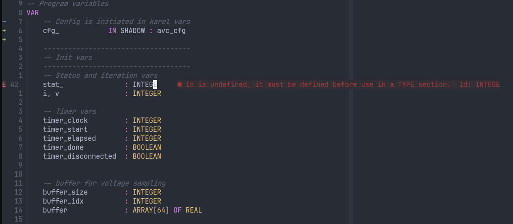
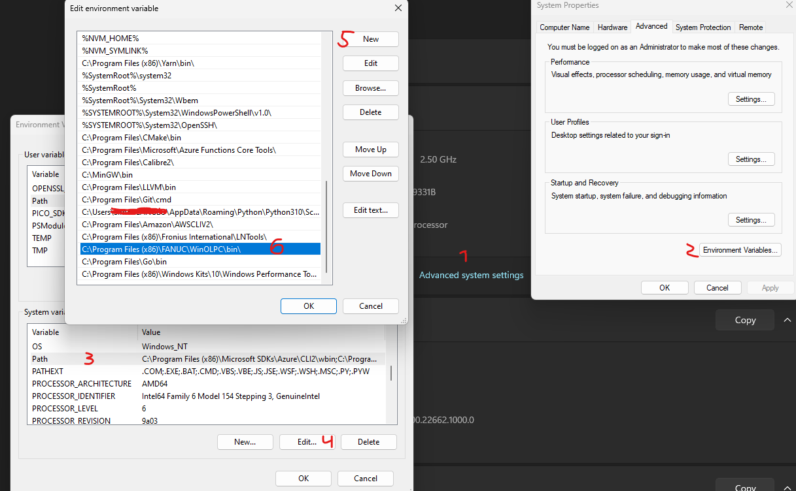

# README
This extension provides [diagnostic information](#example) for Fanuc Karel language in neovim. \
On every save your .kl files are compiled with ktrans, compile errors are then sent to editor.

## Requirements
* Fanuc Roboguide

## Installation
* [Add ktrans to path](#add-to-path)

### Example

*The extension provides diagnostics when saving karel files* 

### Add to path

*Add to path step by step*

